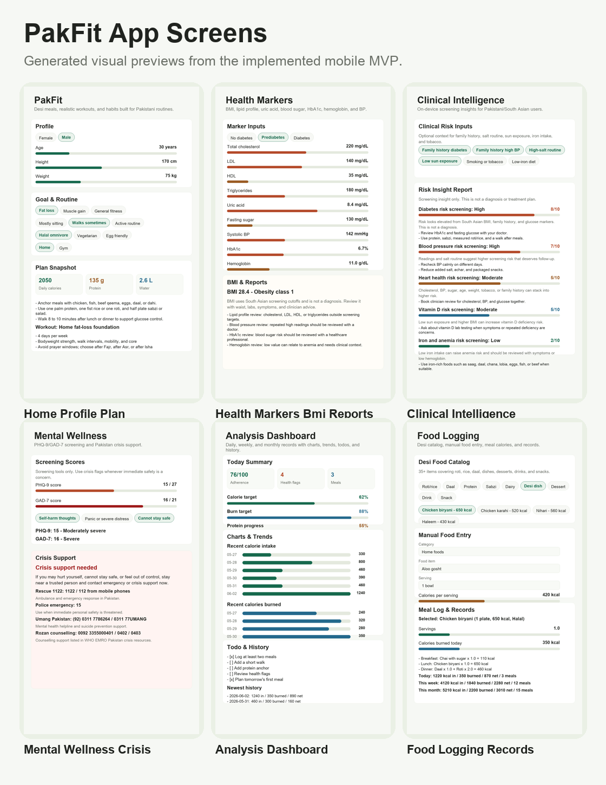
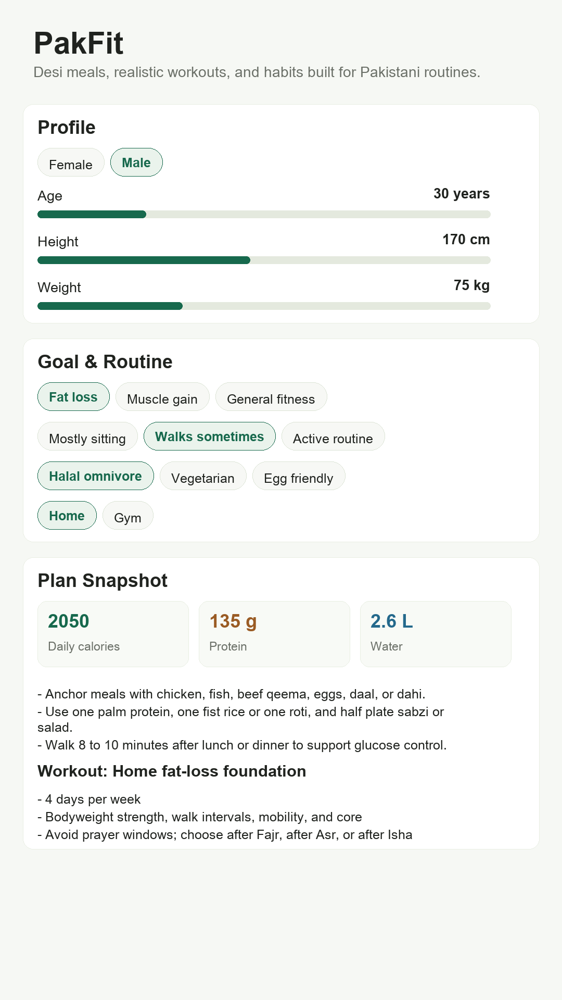
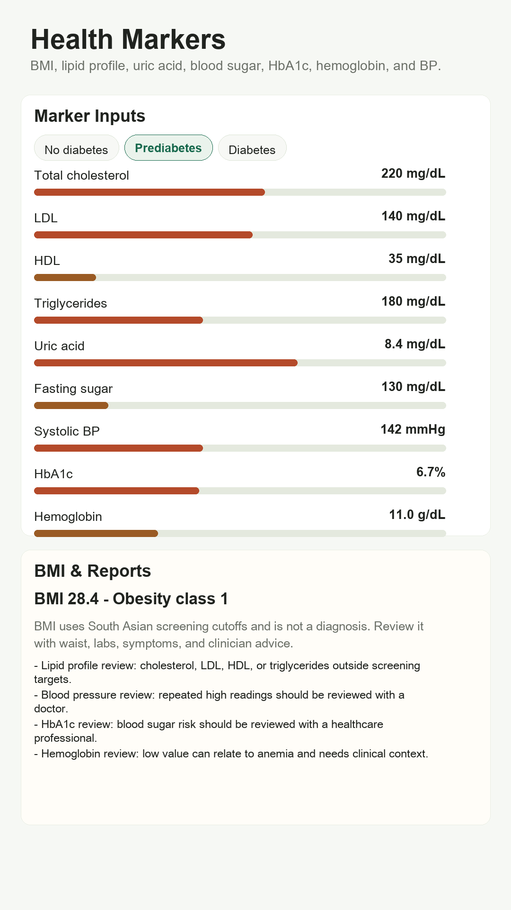
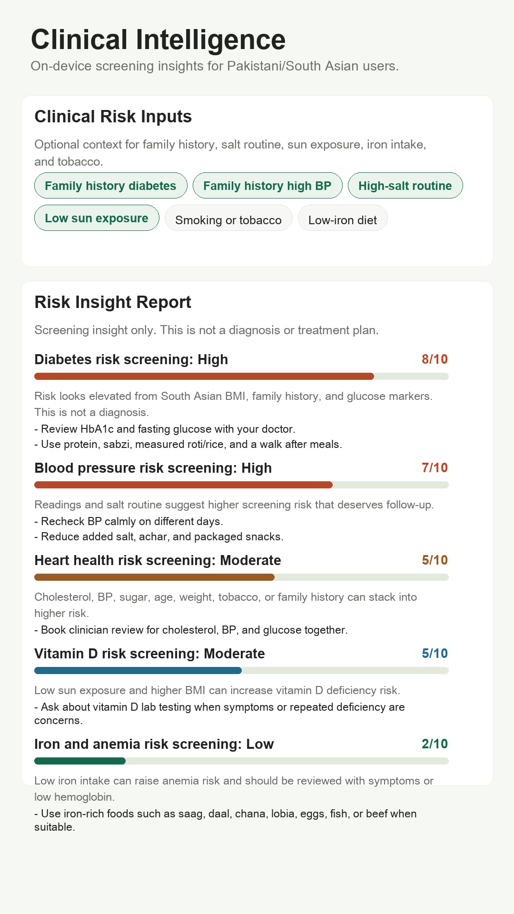
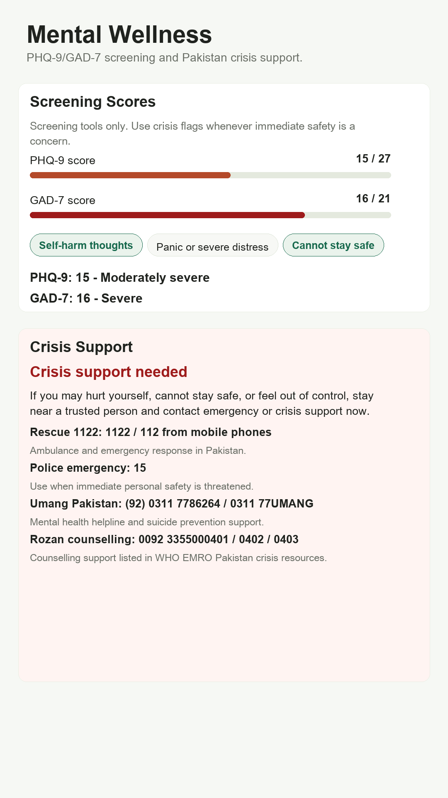
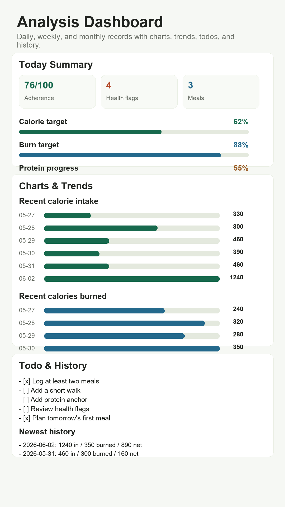
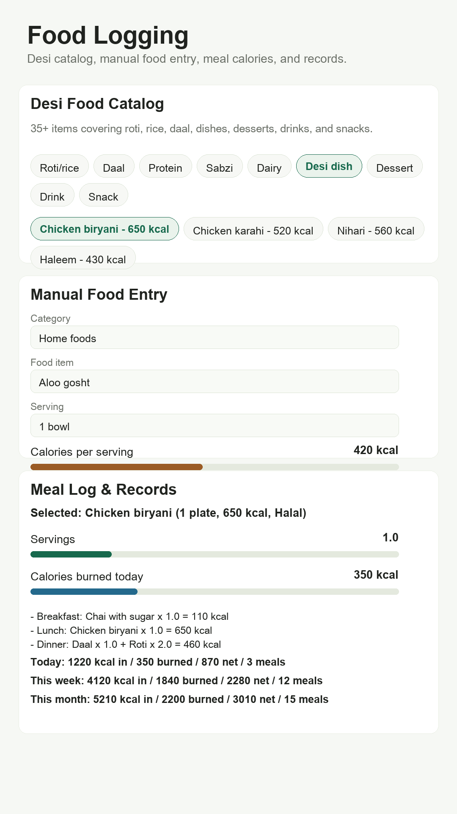

# PakFit Screenshot Gallery

Generated from `work/render_pakfit_screens.py` through `scripts/capture-screenshots.js`.

PakFit is a native Android/iOS app, so these are deterministic store-preview screens rather than browser route screenshots.

## Contact sheet

## Home, profile, and plan

## Health markers, BMI, and reports

## Clinical intelligence

## Mental wellness and crisis support

## Analysis dashboard

## Food logging and records

